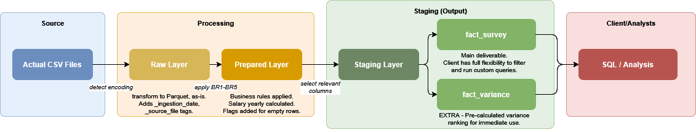

# Survey Data Engineering - Vasco Business Case

## Overview

A daily survey dataset is received as a CSV file. The pipeline ingests it, applies all business rules, and produces clean, analysis-ready tables. The two main questions this solution answers are:

1. Which survey questions have the highest variance in responses?
2. Is there a relationship between years of coding experience and salary?

---

## Project Structure

```
vasco_business_case/
  data/
    raw/                  Source CSV files (input)
    raw_layer/            Raw data as Parquet, unchanged except encoding
    prepared_layer/       Cleaned and transformed data
    staging_layer/        Final tables for consumption
  notebooks/
    etl_pipeline.ipynb    The full ETL pipeline
  schema/
    create_tables.sql     Table DDL for the staging layer
  docs/
    architecture.drawio.png   Architecture diagram
```

---

## Architecture Diagram



---

## Running the Pipeline

1. Place `RawData.csv` and `Columns.csv` in `data/raw/`.
2. Open `notebooks/etl_pipeline.ipynb`.
3. Check the first cell (parameters) and update the paths if the files are in a different location.
4. Run all cells in order.

Output Parquet files are written to `data/raw_layer/`, `data/prepared_layer/`, and `data/staging_layer/`. Any files from a previous run are cleaned up automatically at the start.

To run ad-hoc SQL queries against the output, the last cell in the notebook uses DuckDB to query the Parquet files directly with no database setup required.

---

## Why Parquet?

The source files are CSV. Every downstream layer is written as Parquet instead because:

- **Encoding is fixed automatically.** Parquet stores strings as UTF-8 internally, so whatever encoding the source CSV has, all layers downstream read clean characters.
- **Great compression and query performance.** Parquet is columnar, meaning queries that touch only a few columns skip the rest entirely. This is especially relevant for variance calculations across 100+ columns.
- **Schema is embedded.** Column types are stored in the file, which reduces the risk of type mismatches when loading into a database or querying with a tool like DuckDB.

---

## Pipeline Layers

The pipeline follows three layers, each written as a separate Parquet file.

### Raw Layer

The pipeline reads the CSV using automatic encoding detection (`chardet`). A 200KB sample of the file is enough — chardet's confidence stabilises within the first few KB, so reading the full file would not change the result and would be slower on larger files. The data lands in the Raw Layer as-is, with two metadata columns added to every row: `_ingestion_date` and `_source_file`. These allow any record to be traced back to the exact file and run that produced it.

### Prepared Layer

All business rules are applied to a copy of the raw data, so the Raw Layer is never modified.

| Rule | What it does |
| ---- | ------------ |
| BR1 - Unique respondents | Deduplicates on `Respondent`, keeping the first occurrence. A warning is logged if duplicates are found, as this points to a setup issue in the survey tool. |
| BR2 - Blank Student | Fills blank values with `"No"`. A blank means the respondent is not a student, per the business definition. |
| BR3 - Blank Employment | Fills blank values with `"Employed full-time"`. Same reasoning as above. |
| BR4 - More than 3 empty fields | Does **not** drop rows. Instead, adds three columns: `empty_field_count`, `empty_fields` (list of which fields are null), and `more_than_three_empty` (boolean flag). Dropping rows silently would remove around 96% of the dataset, so the flag is added to let the business decide what to do. |
| BR5 - Yearly salary | Calculates a `salary_yearly` column from `Salary` and `SalaryType`. Weekly values are multiplied by 52, Monthly by 12, and Yearly is kept as-is. Rows with a salary value but no `SalaryType` are set to null — without knowing the frequency, the value cannot be trusted. The original `Salary` and `SalaryType` columns are preserved. |

The dataset also includes a `ConvertedSalary` column provided by the survey platform, already annualised and converted to USD at 2018 exchange rates. The pipeline uses this for cross-country salary comparisons since local currencies would skew the result.

### Staging Layer

The Staging Layer holds a trimmed version of the prepared data with only the columns needed for the two analyses, plus key demographic attributes so results can be broken down by country, dev type, employment, etc. All column names follow `snake_case` for SQL compatibility.

`fact_survey` is the **primary deliverable**. The full prepared dataset remains available in the Prepared Layer if more columns are needed later.

---

## Analyses

### Variance by Question (`fact_variance`)

The pipeline calculates variance across all numeric survey columns. Three columns are excluded from the ranking: `Respondent` (a row ID), `ConvertedSalary`, and `salary_yearly`. Their variance is driven by monetary scale and currency mix rather than by how respondents answered a question, so including them would make the ranking meaningless.

`fact_variance` is a pre-calculated snapshot of the full dataset, giving the business an immediate answer without writing any queries. For any filtered analysis (e.g. variance only for full-time employees), `fact_survey` is the right starting point.

### Salary vs. Years Coding (correlation)

`YearsCoding` is stored as a text range (e.g. `"6-8 years"`). The pipeline maps each range to its midpoint (e.g. `7`) to make the correlation calculation possible. It then calculates the Pearson correlation between `years_coding_numeric` and `ConvertedSalary`. USD-converted salary is used rather than `salary_yearly` to ensure a fair comparison across countries.

---

## Table Schema

See [`schema/create_tables.sql`](schema/create_tables.sql) for the full DDL.

Two tables are defined:

- **`staging.fact_survey`** - one row per respondent, all columns needed for analysis.
- **`staging.fact_variance`** - one row per survey question, with its variance across all respondents.

`VARCHAR(100)` is the default for all text columns. `dev_type` uses `VARCHAR(500)` because it is a semicolon-delimited multi-select field and can be long when a respondent selects many roles.

---

## Cloud Implementation (Azure / Microsoft Fabric)

The pipeline runs locally using Python and pandas. The same logic translates to Azure without structural changes — only the paths and execution environment change.

### Storage

Each layer is stored in **Azure Data Lake Storage Gen2 (ADLS Gen2)** as Parquet files, partitioned by ingestion date. The three-layer structure (Raw, Prepared, Staging) maps directly to separate containers or folders in the same storage account.

### Processing

The notebook logic maps 1:1 to a **Microsoft Fabric Notebook** or an **Azure Databricks** notebook using PySpark. The main difference is that `pd.read_csv` and `df.to_parquet` are replaced with Spark equivalents, and file paths use the `abfss://` format pointing to ADLS Gen2. The business rule logic itself does not change.

### Orchestration

A **Fabric Data Factory pipeline** (or Azure Data Factory) triggers the notebook daily on a schedule. The input file paths are passed as parameters to the notebook, which is why they are defined in a separate parameters cell at the top.

### Serving

There are two options for making the output queryable in Azure:

- **Fabric Data Warehouse** - the DDL in `create_tables.sql` is executed directly to create the tables, and a `COPY INTO` command loads the Parquet files into them. This gives a traditional SQL interface.
- **Fabric Lakehouse with SQL Analytics Endpoint** - if the pipeline writes Delta format instead of Parquet, Fabric automatically exposes the files as queryable tables via a SQL endpoint with no DDL required. The `create_tables.sql` file serves as schema documentation only in this case.

For a first iteration at this scale, the Lakehouse + SQL Analytics Endpoint path is simpler to set up and has lower operational overhead.
